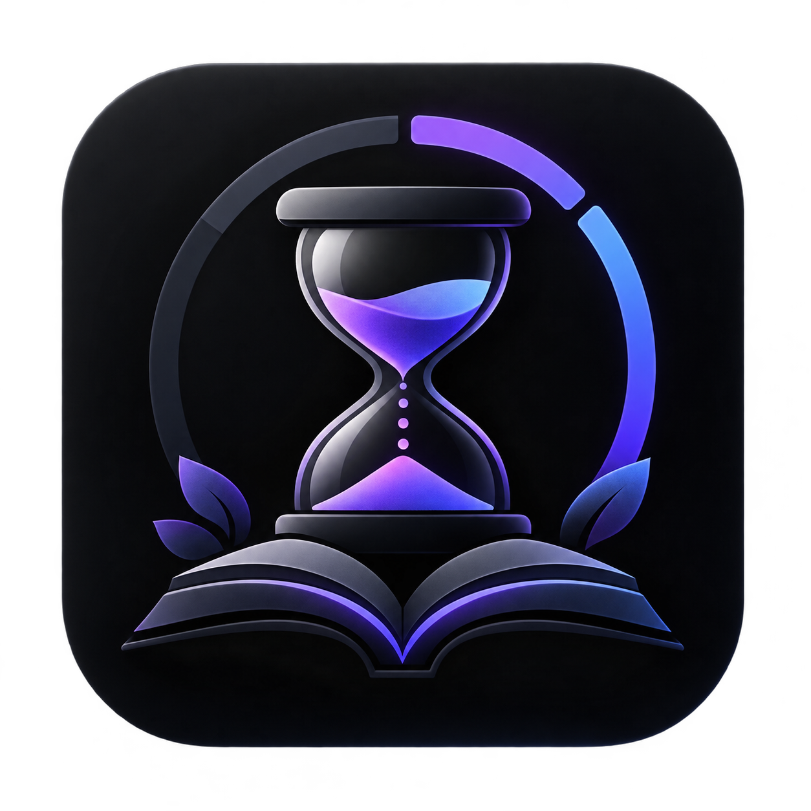

# Chronoa ⏳
### *Automated Smart Study Companion & Focus Timer for Android*

<p align="center">
  
</p>

<p align="center">
  <a href="https://kotlinlang.org"></a>
  <a href="https://developer.android.com/jetpack/compose"></a>
  <a href="https://developer.android.com/about/versions/15"></a>
  <a href="./Chronoa.apk"></a>
  
</p>

---

## 📥 Quick Download & Installation

The latest pre-built production-ready debug APK is available directly in the root of this repository:

👉 **[Download Chronoa.apk (Direct Install)](./Chronoa.apk)** 👈

### 📲 How to Install on Your Android Device:
1. **Download the APK**: Click the [Chronoa.apk](./Chronoa.apk) link above (or download from GitHub Releases/repo files).
2. **Allow Installation from Unknown Sources**:
   - If prompted by your browser or file manager, tap **Settings** and toggle **"Allow from this source"**.
3. **Install the App**: Tap on the downloaded `Chronoa.apk` and tap **Install**.
4. **Grant Required Permissions on First Launch**:
   - **Usage Access**: Allows Chronoa to detect when your approved study apps (e.g., Anki, Notion, YouTube, Calculator) are in the foreground.
   - **Notifications**: Enables real-time focus status and background timer updates in your status bar.
   - **Battery Optimization Exemption** *(Optional but recommended)*: Prevents OEM battery savers from killing the focus tracker during long study sessions.

---

## ✨ What is Chronoa?

**Chronoa** is an intelligent, privacy-first study companion designed to eliminate study distractions and automate session tracking. Unlike traditional Pomodoro timers that require manual start/stop toggling every time you pick up or put down a textbook or open a study app, Chronoa uses an authoritative background **Focus Engine** to automatically track your actual study time with high precision.

---

## 🚀 Key Features

### ⏱️ 1. Automatic Focus Engine
- **Zero-Friction Tracking**: Detects when you open an approved study application and begins tracking focus automatically.
- **Smart Pause & Auto-Resume**: Automatically pauses tracking when you switch to social media, return to the home screen, take a phone call, or split the screen into multi-window mode.
- **Lock-Screen Counting**: Option to continue counting while the screen is locked for audio lectures, flashcard memorization, or offline study sessions.

### 🖥️ 2. Immersive Full-Screen OLED Clock (Ambient Mode)
- **True Black AMOLED Theme**: Optimized for OLED displays to maximize battery efficiency and reduce eye strain in dim environments.
- **Anti-Burn-In Micro-Drift**: Gently shifts clock position every 40 seconds using smooth easing curves to protect your screen from burn-in during hours-long focus marathons.
- **Minimalist Clean UI**: Automatically hides system status bars and secondary controls. Tap anywhere on the screen to reveal action buttons, which fade out automatically after 4 seconds of inactivity.

### 📅 3. Comprehensive Study Calendar & Analytics
- **Monthly Activity Heat-Calendar**: Visual monthly calendar view displaying which days you studied and whether you met your daily focus goals.
- **Daily & Weekly Deep Dives**: View total study time, completion percentages, average session lengths, and streak metrics.
- **App & Subject Breakdown**: See an exact time breakdown for each study app or subject studied.

### 📱 4. Universal Device App Integration
- **Full Device App Discovery**: Browse and add **any application installed on your device** (PDF readers, coding apps, language learning tools, browsers, document editors).
- **Custom Renaming**: Assign friendly custom study labels to any app (e.g., label `com.google.android.youtube` as *"Video Lectures"*).
- **Chronoa Self-Focus**: Full support for studying directly within Chronoa's built-in full-screen timer without extraneous package suffixes.

### 👥 5. Multi-Profile Support & PIN Security
- Manage multiple student profiles (e.g., for different family members or separate exam preparations like Medical, Engineering, or Languages).
- PIN protection to keep study logs, stats, and configurations secure.

### 🔒 6. 100% Offline-First & Private
- All session records, events, and metrics are stored locally on your device via **Room SQLite**.
- No mandatory internet connection required; your study habits and data remain completely yours.

---

## 🛠️ Architecture & Tech Stack

Chronoa is engineered following modern Android architecture best practices:

- **Language**: Kotlin 2.0+
- **UI Toolkit**: Jetpack Compose with Material 3 design system
- **Architecture**: Clean Architecture + MVI/MVVM with unidirectional data flow
- **Database**: Room Persistence Library (SQLite with WAL mode)
- **Preferences**: Jetpack DataStore (Preferences)
- **Reactive Streams**: Kotlin Coroutines & StateFlow / SharedFlow
- **Platform Integration**: `UsageStatsManager`, Android 15 Edge-to-Edge window insets, Foreground Services with `specialUse` subtype

---

## 🏗️ Building From Source

If you want to clone and build Chronoa yourself using Gradle or Android Studio:

### Prerequisites:
- **Android Studio Ladybug (2024.2+)** or later
- **JDK 17** or **JDK 21**
- **Android SDK Platform 35** (Android 15)

### Clone & Build Commands:
```bash
# Clone the repository
git clone https://github.com/Shashank028R/Chronoa.git

# Navigate into project directory
cd Chronoa

# Run unit tests to verify system integrity
./gradlew testDebugUnitTest

# Assemble the debug APK
./gradlew assembleDebug

# Install directly to a connected device via ADB
adb install -r app/build/outputs/apk/debug/app-debug.apk
```

---

## 📜 Permissions Summary

| Permission | Purpose |
| :--- | :--- |
| `android.permission.PACKAGE_USAGE_STATS` | Authoritative foreground app tracking via Android UsageEvents API. |
| `android.permission.QUERY_ALL_PACKAGES` | Allows discovering and selecting all installed study apps on device. |
| `android.permission.FOREGROUND_SERVICE` | Keeps the study timer reliable and active during continuous study. |
| `android.permission.POST_NOTIFICATIONS` | Displays the active study session indicator and controls in the notification shade. |
| `android.permission.READ_PHONE_STATE` | Automatically pauses study timer when an incoming phone call is received. |
| `android.permission.RECEIVE_BOOT_COMPLETED` | Restores timer service and recovery alarms upon device reboot. |

---

## 📄 License

This project is licensed under the Apache License 2.0 - see the LICENSE file for details.

---

<p align="center">
  <b>Designed with precision for students, scholars, and lifelong learners.</b><br />
  Made with ❤️ by Shashank
</p>
